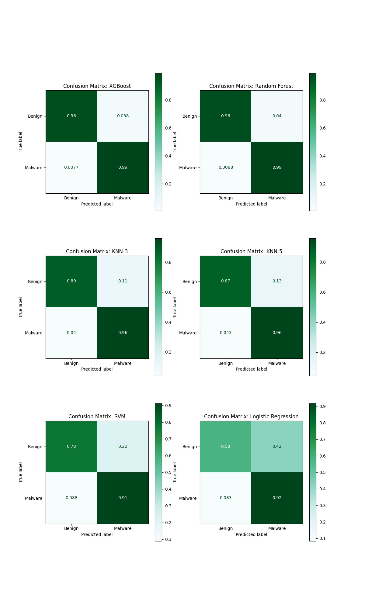
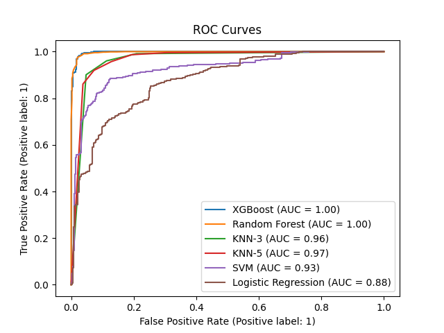
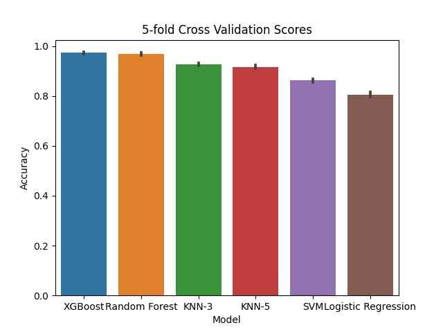

# Malware Detection from Network Captures
Kevin Hannay

-   [<span class="toc-section-number">1</span>
    Introduction](#introduction)
    -   [<span class="toc-section-number">1.1</span>
        Assumptions](#assumptions)
-   [<span class="toc-section-number">2</span> Feature
    Engineering](#feature-engineering)
-   [<span class="toc-section-number">3</span> Model
    Selection](#model-selection)
-   [<span class="toc-section-number">4</span> ML Ops
    Pipeline](#ml-ops-pipeline)
-   [<span class="toc-section-number">5</span>
    Conclusions](#conclusions)

## Introduction

This report summarizes the work done in creating a classification model
for malware detection from network captures (PCAP) files. The project is
organized into a set of Jupyter notebooks located in the `nbs`
directory, with the majority of the logic located in the
`nbs/00_core.ipynb` notebook. Additionally, using the `nbdev` library,
the code in the notebooks is exported to a python package located in the
`mdetect` directory.

From the home directory of the project the python package can be
installed using the following command:

``` {bash}
#| eval: false
pip install -e .
```

The python package also defines three command line scripts which can be
used to run the project from the command line. These scripts are defined
in the `01_cli.ipynb` notebook and are as follows:

-   `malware-train`: Train a model on a set of PCAP files, this will run
    the training loop given paths to directories containing the PCAP
    files for malware and benign samples. The model is saved to a pickle
    file and can be used for prediction (malware-predict).
-   `malware-transform`: Transform a set of PCAP files into a set of
    features which can be used for classification. This just performs
    the feature engineering step and saves the features CSV files for
    the flows provided alongside labels for the flows.
-   `malware-predict`: Predict the labels for a set of flows using a
    trained model. This will load a model from a pickle file and then
    use the model to predict the labels for the flows provided.
    Currently this script prints the number of malware flows identified
    in the file and the total number of flows in the file.

Each of these scripts can be run with the `--help` flag to get more
information on the arguments required. This report is a high level
overview of the project and the notebooks contain more detailed
information on the implementation of the project.

### Assumptions

For the purposes of this project I made the following assumptions about
the customer need:

-   This model would be deployed on networks that aren’t in the training
    data, i.e. we don’t have PCAP files which can be used to build a
    baseline for benign traffic for the specific network. If this data
    is available then it could be used to improve the model performance.
-   The cost of missing malware is higher than the cost of mistakenly
    classifying benign traffic as malware generated. However, this
    difference isn’t extreme since mistakenly flagging benign traffic as
    malware will degrade trust in the ML pipeline and potentially annoy
    users.
-   The ML pipeline should be efficient enough to run at scale.
    Basically, don’t pick a model that is expensive or slow to run.

## Feature Engineering

The first step in the project is to transform the raw PCAP data into a
set of features which can be used for classification. For this I made
use of the `scapy` python library and created some wrappers and data
structures to process and store the data in the raw PCAP files. My
strategy for processing the PCAP files was to focus on TCP/UDP traffic
and separate the files into separate flows or sessions. These flows are
defined by unique 5-tuples of
`(src_ip, dst_ip, src_port, dst_port, protocol)`, and then these flows
were further broken down along the time dimension by splitting up
packets within a flow along the time axis. The logic behind this step
was the need for this model to generalize to new PCAP files which may
have more or less benign traffic overlayed on the malicious traffic.
From examining the PCAP files in Wireshark it looks like some of the
malware files have been filtered already to highlight the malware
traffic. The conversion from PCAP to flows should help reduce the impact
of benign traffic on the model, and make the model more portable to new
networks.

My overall technique focused on extracting features which should
generalize well when applied to new network captures. Therefore, I tried
to avoid using features that might be specific to the particular network
used in the capture. For example, while I developed some features based
on the Inner Arrival Times of the packets I avoided using these features
in the final model as they would be specific to the network used in the
capture. However, in the event that we have access to data collected on
a single network, these features could be used to improve the model.

In the end I ended up constructing a set of 23 features (before
one-hot-encoding) which I used in the final model. These features are as
follows:

``` python
from IPython.display import Markdown
from tabulate import tabulate
feature_names = ['duration', 'pkts_rate', 'bytes_rate', 'mean_size', 'std_sizes',
       'q1_sizes', 'q2_sizes', 'q3_sizes', 'min_sizes', 'max_sizes',
       'num_pkts', 'num_bytes', 'flags_FIN', 'flags_SYN', 'flags_RST', 'flags_PSH', 'flags_ACK',
       'flags_URG', 'flags_ECE', 'flags_CWR', 'src_port', 'dst_port', 'protocol',]
feature_type = ['numeric' for _ in range(20)]  + ['categorical' for _ in range(3)]
descriptions = ["Duration of the flow", "Rate of packet flow", "Rate of bytes transmitted", "Mean size of the packets", "Standard Devation in Packet size", "First quartile in sizes", "second quartile (median) in sizes", "Third quartile in sizes", "minimum size", "maximum size", "Total number of packets", "Total bytes", "Total FIN flags", "Total SYN flags", "Total RST flags", "total PSH flags", "total ACK flags", "Total URG flags", "Total ECE flags", "total CWR flags", "Source port", "Destination ports", "Protocol (UDP/TCP/ICMP)"]
feature_table = list(zip(feature_names, feature_type, descriptions))

Markdown(tabulate(
  feature_table, 
  headers=["Name","Type", "Description"]
))
```

<table>
<caption>Table 1: The features used in the classification
algorithms</caption>
<thead>
<tr class="header">
<th style="text-align: left;">Name</th>
<th style="text-align: left;">Type</th>
<th style="text-align: left;">Description</th>
</tr>
</thead>
<tbody>
<tr class="odd">
<td style="text-align: left;">duration</td>
<td style="text-align: left;">numeric</td>
<td style="text-align: left;">Duration of the flow</td>
</tr>
<tr class="even">
<td style="text-align: left;">pkts_rate</td>
<td style="text-align: left;">numeric</td>
<td style="text-align: left;">Rate of packet flow</td>
</tr>
<tr class="odd">
<td style="text-align: left;">bytes_rate</td>
<td style="text-align: left;">numeric</td>
<td style="text-align: left;">Rate of bytes transmitted</td>
</tr>
<tr class="even">
<td style="text-align: left;">mean_size</td>
<td style="text-align: left;">numeric</td>
<td style="text-align: left;">Mean size of the packets</td>
</tr>
<tr class="odd">
<td style="text-align: left;">std_sizes</td>
<td style="text-align: left;">numeric</td>
<td style="text-align: left;">Standard Devation in Packet size</td>
</tr>
<tr class="even">
<td style="text-align: left;">q1_sizes</td>
<td style="text-align: left;">numeric</td>
<td style="text-align: left;">First quartile in sizes</td>
</tr>
<tr class="odd">
<td style="text-align: left;">q2_sizes</td>
<td style="text-align: left;">numeric</td>
<td style="text-align: left;">second quartile (median) in sizes</td>
</tr>
<tr class="even">
<td style="text-align: left;">q3_sizes</td>
<td style="text-align: left;">numeric</td>
<td style="text-align: left;">Third quartile in sizes</td>
</tr>
<tr class="odd">
<td style="text-align: left;">min_sizes</td>
<td style="text-align: left;">numeric</td>
<td style="text-align: left;">minimum size</td>
</tr>
<tr class="even">
<td style="text-align: left;">max_sizes</td>
<td style="text-align: left;">numeric</td>
<td style="text-align: left;">maximum size</td>
</tr>
<tr class="odd">
<td style="text-align: left;">num_pkts</td>
<td style="text-align: left;">numeric</td>
<td style="text-align: left;">Total number of packets</td>
</tr>
<tr class="even">
<td style="text-align: left;">num_bytes</td>
<td style="text-align: left;">numeric</td>
<td style="text-align: left;">Total bytes</td>
</tr>
<tr class="odd">
<td style="text-align: left;">flags_FIN</td>
<td style="text-align: left;">numeric</td>
<td style="text-align: left;">Total FIN flags</td>
</tr>
<tr class="even">
<td style="text-align: left;">flags_SYN</td>
<td style="text-align: left;">numeric</td>
<td style="text-align: left;">Total SYN flags</td>
</tr>
<tr class="odd">
<td style="text-align: left;">flags_RST</td>
<td style="text-align: left;">numeric</td>
<td style="text-align: left;">Total RST flags</td>
</tr>
<tr class="even">
<td style="text-align: left;">flags_PSH</td>
<td style="text-align: left;">numeric</td>
<td style="text-align: left;">total PSH flags</td>
</tr>
<tr class="odd">
<td style="text-align: left;">flags_ACK</td>
<td style="text-align: left;">numeric</td>
<td style="text-align: left;">total ACK flags</td>
</tr>
<tr class="even">
<td style="text-align: left;">flags_URG</td>
<td style="text-align: left;">numeric</td>
<td style="text-align: left;">Total URG flags</td>
</tr>
<tr class="odd">
<td style="text-align: left;">flags_ECE</td>
<td style="text-align: left;">numeric</td>
<td style="text-align: left;">Total ECE flags</td>
</tr>
<tr class="even">
<td style="text-align: left;">flags_CWR</td>
<td style="text-align: left;">numeric</td>
<td style="text-align: left;">total CWR flags</td>
</tr>
<tr class="odd">
<td style="text-align: left;">src_port</td>
<td style="text-align: left;">categorical</td>
<td style="text-align: left;">Source port</td>
</tr>
<tr class="even">
<td style="text-align: left;">dst_port</td>
<td style="text-align: left;">categorical</td>
<td style="text-align: left;">Destination ports</td>
</tr>
<tr class="odd">
<td style="text-align: left;">protocol</td>
<td style="text-align: left;">categorical</td>
<td style="text-align: left;">Protocol (UDP/TCP/ICMP)</td>
</tr>
</tbody>
</table>

Table 1: The features used in the classification algorithms

The PCAP files were processed into a set of these flows where each flow
was labeled as being from a malicious capture (1) or a benign capture
(0). I supplemented the benign PCAP files with two additional PCAP files
since the benign data set provided has significantly fewer flows that
the aggregate of the malware samples (these supplemental data sets are
included in the data directory of the repo). The data was divided into a
training and validation sets randomly with 30% being allocated to
validation.

## Model Selection

I tested a set of machine learning pipelines on this processed data set,
as can be seen in the `00_core.ipynb`. The confusion matrices for the
model pipelines applied to the validation data flows are shown in figure
[Figure 1](#fig-confusion-matrix). The random forest and XGBoost
classifiers perform the best achieving accuracies in the high 90’s.



The confusion matrices error rates can be adjusted by adjusting the
thresholds used to make a binary classification. To account for this
ambiguity we can examine the ROC curves which show the true positive
rate (TPR) vs the false positive rate (FPR) for the different models.
The ROC curves for the different models are shown in figure
[Figure 2](#fig-roc-curves). The area under these curves is the AUC
metric which is a measure of the overall accuracy of the model.



We can also examine the model calibration which is a measure of how well
the model probabilities match the true probabilities. The calibration
curves for the different models are shown in figure
[Figure 3](#fig-calibration-curves). The calibration curves show that
each of the models are reasonably well calibrated.


I applied a 5-fold cross validation procedure for each of the model
pipelines as well. The results of this cross validation are shown in
figure [Figure 4](#fig-cross-validation). The cross validation results
show that the random forest and XGBoost classifiers perform the best
overall, and each of these models have a small degree of variance in
their performance. This indicates they haven’t been overfit to the
training data.



The principal metric I used in comparing models was the (AUC: Area under
the Curve) based on ROC Curves for the models as seen in figure
[Figure 2](#fig-roc-curves). The random forest and XGBoost classifiers
performed the best overall. This isn’t surprising since these models are
the standard for tabular data classification problems like the one
considered here. Overall I would recommend the XGBoost classifier
because of its ease in implementation on the elastic stack (although
random forests are almost as easy as well), speed of training and
inference.

The poor performance for the SVM/Logistic Regression models is likely
due to the fact that the data is not linearly separable. A neural
network model will likely perform worse than these models (and indeed
they do in my experimentation) since they assume some smoothness in the
data which is not present here. The details for the models are outlined
in the `nbs/00_core.ipynb` notebook.

Finally, after completing my analysis and model tuning I evaluated the
ML models on a small test data set not used in training or validation.
For this I used a PCAP file for malware not contained in the training or
validation data [available
here](https://malware-traffic-analysis.net/2022/01/07/index.html). I
also collected some benign results from my home network to evaluate the
model on. These test PCAP files are located in the `data/test`
directory. The results of the test are shown in figure
[Figure 5](#fig-test-results). The XGBoost model performs the best on
the test data as well, with a small drop in the accuracy seen for the
validation and cross validation data.


## ML Ops Pipeline

Since the underlying classifier is the well known XGBoost classifier
this whole stack can be configured to run on elastic cloud as a
classification task. The model training can also be done on an elastic
ML node using a data frame analytics job. Integrating with the elastic
stack takes care of a lot of the ML Ops pipeline including feature
registry, model versioning, and model deployment. Testing and monitoring
can also be done within the elastic stack using a Kibana dashboard.

At a broad level the pipeline steps for inference are:

-   Transform a PCAP file into a set of flows and compute the summary
    features for each flow.
-   Call the XGBoost model to make a prediction on each flow.
-   Index the flows into elastic search with the prediction (malware
    probability) as a field.
-   Visualize the predictions and log key metrics.


In the figure [Figure 6](#fig-ml-ops-pipeline) I have illustrated a flow
where the initial PCAP data is stored in AWS S3 and then inserted into
elastic search using an ingestion pipeline. I is also possible that
filtered PCAP data is streamed directly into a ingestion pipeline if
that is a customer need. However, given the shear size of PCAP data
files I have illustrated the pipeline with batched runs from an S3
bucket. This pipeline would effectively run featuring engineering
pipeline PCAP -\> Flows -\> Statistics on the ingested PCAP data and
insert the data into a elastic data frame.

In order to support a effective CI/CD pipeline I would advocate that
this process is put under a CI/CD pipeline linked to a source
repository, so that any changes to the malware-transform function are
automatically deployed to the elastic cloud from the main branch of the
repository. The next step in the pipeline is to call the machine
learning model on new data inserted into elastic. A registered
classification model within elastic can be added to a ingestion pipeline
so that the malware probability prediction is added to the data as it is
indexed into elastic.

Model training could also be performed within the elastic cloud using a
data frame analytics job, or models can be trained externally and then
registered using the `eland` library and the data frame analytics API.
This also allows for the same key metrics I have outlined in the
`00_core.ipynb` notebook to be computed and logged within elastic.
Including the classification accuracy, confusion matrix, ROC curves, and
visualizations of this logged data.

For a deployed model we can also monitor the performance of the model
using a Kibana dashboard. This dashboard can be configured to show the
key metrics for the model and also to show the distribution of the
malware probability predictions. This allows for the implementation of
MLOps techniques like drift detection on the input data and changes in
the model performance over time. Moreover, outlier detection and alerts
can be configured to notify the user of anomalous behavior in the
classifier predictions. For example, a sudden increase in the number of
malware predictions could indicate a new malware attack or that some
benign traffic has been misclassified as malware.

## Conclusions

In this project I have demonstrated the use of machine learning to
classify network traffic as either malicious or benign. I have shown
that the XGBoost/Random forest classifiers perform the best overall in
this task, after designing a feature engineering workflow to extract
tabular data from raw PCAP files. I have also outlined a ML Ops pipeline
for the training, deployment and testing of a malware prediction model
within the elastic stack.

The next step in future work would be to scale up the amount and variety
of data used to train the models. The high degree of variability in
network traffic has hardly been captured in these demo data sets and
more data is needed to do a complete assessment of the classifiers,
especially in terms of their robustness to different types of malware
and network traffic. Once I had collected additional data I would spend
some additional time doing some hyper-parameter tuning on the XGBoost
model to see if I could improve the performance of the model. I have
used a bayesian optimization routine for this tuning in the past and
expect it would work well under these circumstances.

As a more long term project I would like to explore the use of
techniques from Natural Language Processing to malware detection from
network traffic. The idea would be to translate the flows into a
symbolic language describing the packets and then apply a transformer
architecture to the problem. The ability of transformers to capture long
range dependencies in sequences of symbols would be well suited to this
problem. This model could be run alongside the XGBoost summary statistic
approach as an ensemble model to detect malware signatures from the
network traffic. Elastic has added support for NLP (hugging face) models
and this would provide a good opportunity to explore this new feature.
